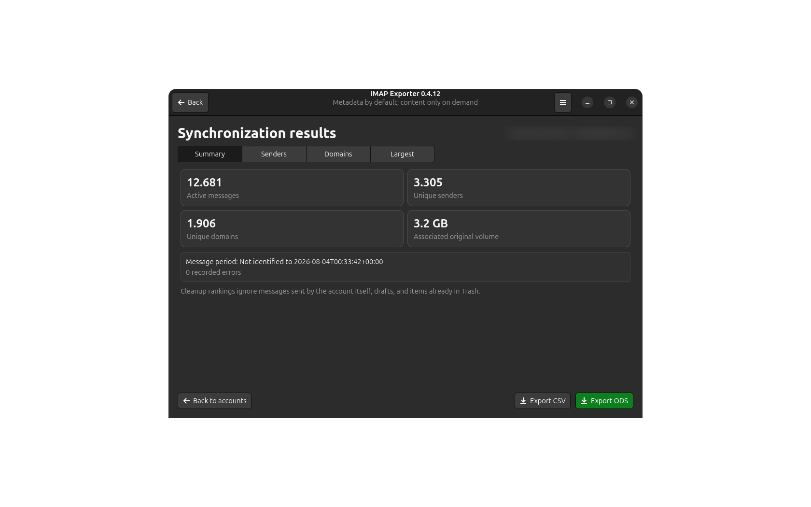
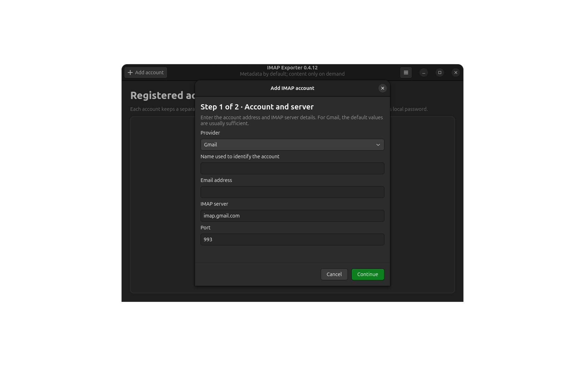
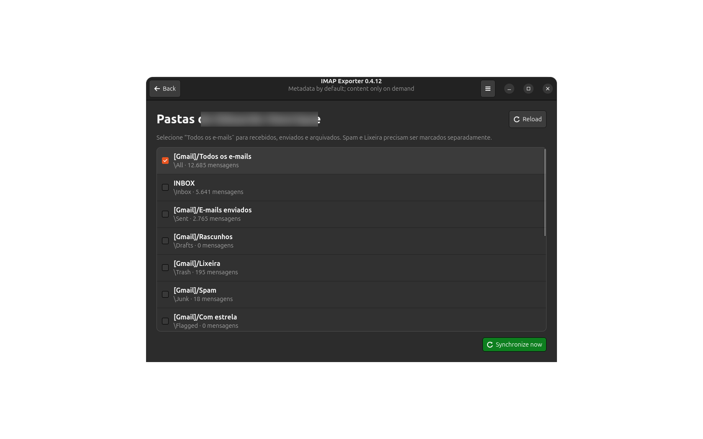
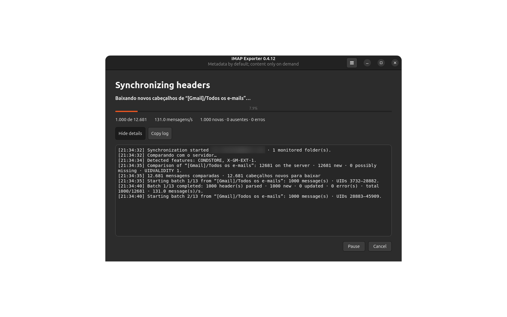
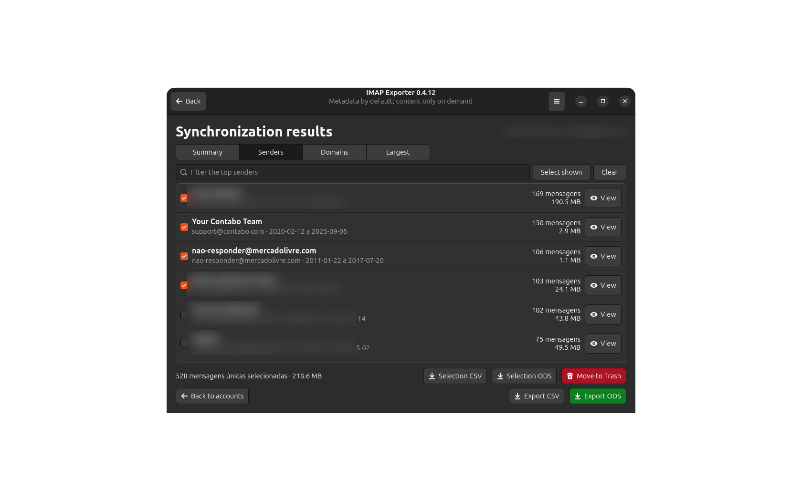
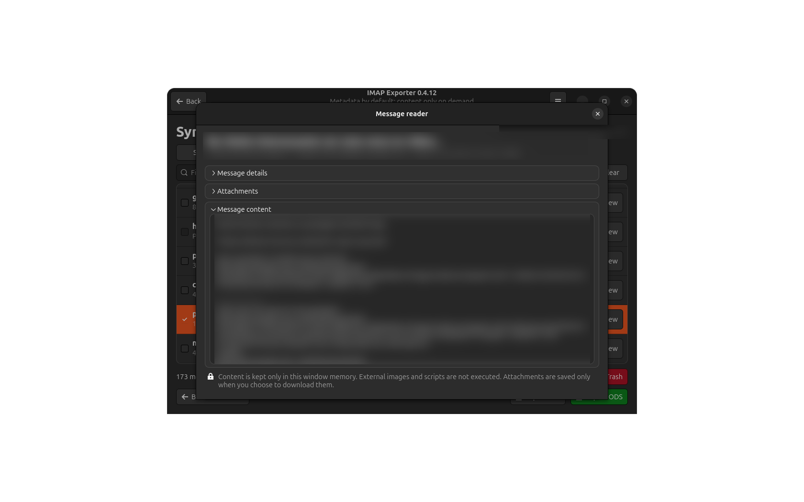
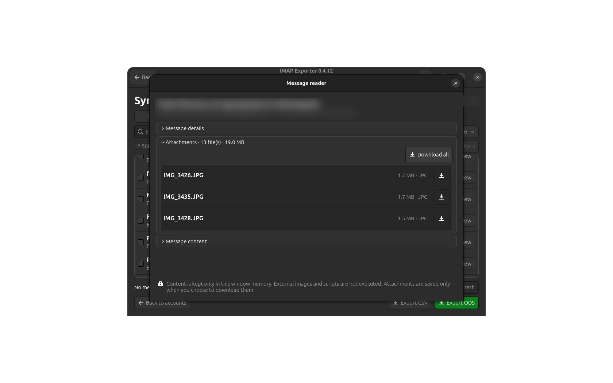
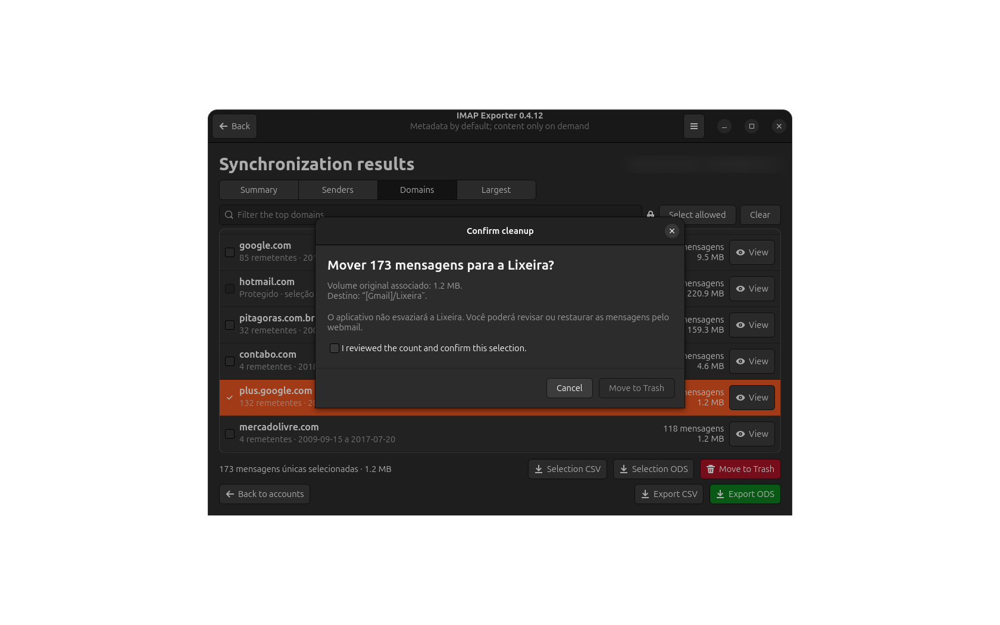
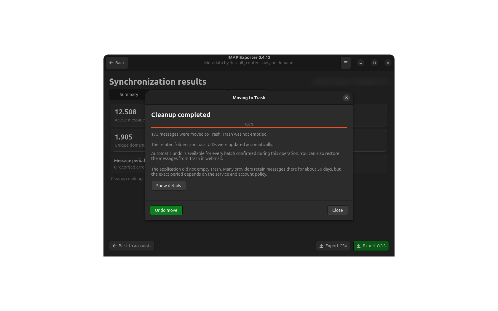

<p align="right">
  <a href="README.md">English</a> · <strong>Português (Brasil)</strong>
</p>

<p align="center">
  
</p>

<h1 align="center">IMAP Exporter</h1>

<p align="center">
  Sincronize, analise, organize e exporte metadados de e-mail por IMAP.
</p>

<p align="center">
  
  
  
  
  
</p>

<p align="center">
  
</p>

O IMAP Exporter é um aplicativo desktop Linux multiconta para examinar caixas
postais grandes sem baixar o corpo de todos os e-mails. A sincronização normal
armazena cabeçalhos, identificadores, estado das pastas, tamanho das mensagens e
estrutura MIME. O texto das mensagens e os bytes dos anexos são solicitados
somente quando você decide abri-los ou baixá-los.

> [!IMPORTANT]
> O IMAP Exporter é uma ferramenta de análise e limpeza, não um cliente de e-mail
> nem um aplicativo de backup. Confira uma seleção pequena no webmail antes de
> movimentar lotes grandes.

## Destaques

- Várias contas IMAP, cada uma com histórico local e credencial criptografada
  independentes.
- Cadastro em duas etapas, com provedores pré-configurados e opção de servidor
  manual.
- Sincronização incremental: UIDs conhecidos permanecem no índice e somente
  cabeçalhos desconhecidos são obtidos em lotes.
- Pausa, continuação e cancelamento seguro com ponto de retomada.
- Rankings por remetente, domínio e tamanho, com busca, intervalo de datas,
  anexos, tamanho mínimo e várias extensões simultâneas.
- Leitor leve baseado em `BODY.PEEK`, com HTML convertido em texto seguro e sem
  executar imagens externas ou scripts.
- Inspeção e download de anexos sob demanda, com progresso real em cada linha,
  cancelamento individual ou em lote e descarte de temporários incompletos.
- Exportação completa ou da seleção atual em CSV e ODS.
- Movimentação em lote para a Lixeira com confirmação, progresso, log técnico e
  reversão quando o servidor fornece identificadores que tornam a restauração
  segura.
- Interface em português e inglês, ícones simbólicos e estilo GTK 4 testado em
  GNOME, LXQt/Lubuntu e outros ambientes Linux.

## Capturas de tela

<details>
<summary><strong>Abrir galeria da interface</strong></summary>

### Cadastro da conta e seleção de pastas

<p align="center">
  
  
</p>

### Sincronização e análise

<p align="center">
  
  
</p>

### Leitura segura e anexos

<p align="center">
  
  
</p>

### Limpeza e reversão

<p align="center">
  
  
</p>

</details>

Todas as capturas incluídas neste repositório foram revisadas e anonimizadas
antes da publicação. O conjunto completo está em
[`docs/screenshots`](docs/screenshots).

## Privacidade e proteção das credenciais

1. A senha local da conta deve ter no mínimo oito caracteres e nunca é gravada.
2. A senha IMAP é criptografada com AES-256-CBC e PBKDF2 pelo OpenSSL.
3. Um HMAC separado verifica a integridade antes da descriptografia.
4. As credenciais abertas ficam somente na memória do processo enquanto a
   conta estiver desbloqueada.
5. Bloquear novamente a conta elimina a sessão mantida na memória.
6. A troca da senha local recriptografa imediatamente a credencial IMAP.

Não existe recuperação da senha local. Se ela for esquecida, a conta bloqueada
poderá ser removida pela autorização administrativa nativa do sistema. Esse
fluxo apaga somente cadastro, credencial criptografada e metadados locais; ele
não descriptografa a credencial, não se conecta ao IMAP e não altera mensagens
no servidor.

A sincronização normal não obtém o corpo das mensagens nem os bytes dos anexos.
O leitor solicita apenas o e-mail escolhido e mantém seu conteúdo na memória da
janela. Os bytes de um anexo só são gravados no local escolhido pelo usuário.

## Provedores pré-configurados

| Provedor | Servidor IMAP | Porta | Observação |
| --- | --- | ---: | --- |
| Gmail | `imap.gmail.com` | 993 | Normalmente exige senha de app |
| UOL Mail | `imap.uol.com.br` | 993 | Senha da caixa postal |
| BOL Mail | `imap.bol.com.br` | 993 | Senha da caixa postal |
| Terra Mail | `imap.terra.com.br` | 993 | Senha da caixa postal |
| Yahoo Mail | `imap.mail.yahoo.com` | 993 | Normalmente exige senha de app |
| iCloud Mail | `imap.mail.me.com` | 993 | Exige senha específica de app |
| AOL Mail | `imap.aol.com` | 993 | Pode exigir senha de app |
| GMX Mail | `imap.gmx.com` | 993 | O acesso IMAP deve estar ativo |
| Mail.ru | `imap.mail.ru` | 993 | Exige senha para aplicativo externo |

`Outro servidor IMAP` aceita qualquer serviço compatível com autenticação por
senha em IMAP sobre SSL/TLS. Outlook.com, Hotmail e outros serviços exclusivos
de OAuth2 não foram incluídos porque a versão 0.4.13 ainda não implementa OAuth2.
O Proton Mail depende do aplicativo Bridge, e não de uma conexão IMAP direta
comum.

As exigências dos provedores podem mudar. Confirme o acesso IMAP e o tipo de
senha na documentação atual do serviço.

## Instalação

### Pacote Debian — recomendado

Em Debian, Ubuntu, Lubuntu, Linux Mint e derivados:

```bash
sudo apt install ./imap-exporter_0.4.13_all.deb
```

Ao usar `apt install`, o sistema instala as dependências declaradas: Python 3,
PyGObject, GTK 4, OpenSSL, certificados, Polkit/pkexec e o tema-base de ícones.
O pacote disponibiliza o comando `imap-exporter` e inclui o aplicativo no menu
do ambiente gráfico.

### Pacote de código-fonte

O aplicativo não possui dependências de `pip`. Em uma instalação desktop padrão
do Ubuntu, extraia o código-fonte e execute:

```bash
./run.sh
```

Caso a permissão de execução não tenha sido preservada:

```bash
chmod +x run.sh
./run.sh
```

### Clonar o repositório

Em distribuições baseadas em Debian, instale as dependências:

```bash
sudo apt install python3 python3-gi gir1.2-gtk-4.0 openssl \
  ca-certificates hicolor-icon-theme pkexec
```

Depois clone e execute:

```bash
git clone https://github.com/ehstbr/IMAP-Exporter.git
cd IMAP-Exporter
./run.sh
```

A remoção administrativa de uma conta bloqueada depende do auxiliar privilegiado
e da política Polkit instalados pelo pacote Debian. As demais funções podem ser
testadas diretamente pela árvore de código-fonte.

## Dados locais

Novas instalações armazenam o banco SQLite em:

```text
~/.local/share/imap-exporter/imap-exporter.sqlite3
```

A aplicação usa exclusivamente esse diretório e esse nome de banco. Caminhos,
variáveis de ambiente, bancos, esquemas e formatos de credencial de versões
anteriores não são migrados nem reutilizados automaticamente.

## Como funcionam a sincronização e a limpeza

A Caixa de entrada pode não representar toda a conta. No Gmail, `Todos os
e-mails` reúne mensagens recebidas, enviadas e arquivadas, enquanto Spam e
Lixeira permanecem separados. Em outros servidores, prefira a pasta marcada com
o atributo especial `\All` ou selecione manualmente as pastas necessárias.

Cada sincronização obtém a lista atual de UIDs, compara com o índice local e
baixa cabeçalhos completos apenas para UIDs desconhecidos. Vínculos ausentes são
marcados como inativos depois que a pasta termina com sucesso; mensagens
restauradas voltam a ficar ativas quando retornam ao escopo monitorado. O comando
de manutenção `Reconstruir índice local` remove somente metadados e nunca altera
o servidor.

Por segurança, a limpeza:

- ignora mensagens enviadas pela própria conta, rascunhos e itens já presentes
  na Lixeira;
- protege domínios compartilhados, como `gmail.com`, contra seleção total;
- exige que a conta continue desbloqueada;
- nunca esvazia a Lixeira;
- recusa a operação quando o servidor não oferece `MOVE`, `UIDPLUS` ou outro
  mecanismo seguro compatível, evitando um `EXPUNGE` global.

## Metadados coletados

- Nome, endereço e domínio do remetente.
- `Sender`, `Reply-To`, `Return-Path`, `Delivered-To` e `X-Original-To`.
- Destinatários `To`, `Cc` e `Bcc`, quando disponíveis.
- Assunto, data do cabeçalho e data interna do servidor.
- `Message-ID`, IDs específicos do provedor e ID da conversa.
- Pasta de origem, UID, marcadores, flags e tamanho original.
- `In-Reply-To`, `References` e `List-ID`.
- Estrutura MIME dos anexos: seção IMAP, nome, extensão, tipo, codificação e
  tamanho codificado.

Para mensagens novas, `BODYSTRUCTURE` é coletado junto com a consulta dos
cabeçalhos. Índices antigos podem completar a análise de anexos por
`Completar análise`, que solicita somente `UID + BODYSTRUCTURE` e não repete o
download dos cabeçalhos.

## Testes

```bash
/usr/bin/python3 -m unittest discover -s tests -v
```

O GitHub Actions executa a mesma suíte em cada `push` e `pull request`.

## Documentação e contribuições

- [Histórico de alterações](CHANGELOG.md)
- [Guia de contribuição](CONTRIBUTING.md)
- [Política de segurança](SECURITY.md)
- [Termos de uso](TERMS.md)
- [Avisos de terceiros — inglês](THIRD_PARTY_NOTICES.en.md)
- [Avisos de terceiros — português](THIRD_PARTY_NOTICES.pt_BR.md)

Erros comuns e sugestões podem ser enviados pelas
[Issues do GitHub](https://github.com/ehstbr/IMAP-Exporter/issues). Não publique
falhas de segurança em uma Issue; siga as orientações de [SECURITY.md](SECURITY.md).

## Autor e licença

Desenvolvido por **Eduardo Henrique Silva Teixeira**  
Site: <https://eduhcommerce.com.br>  
Contato: <contato@eduhcommerce.com.br>

Distribuído sob a [Licença MIT](LICENSE).
